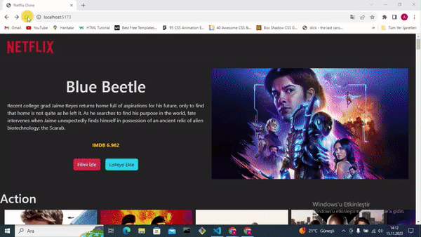

# Netflix-Clone

# KÜtüphaneler

- react-router-dom
- @splidejs/react-splide
- axios
- redux
- redux-thunk
- react-redux

# Yapılacak İşlemler

- Dosya Yapısının hazırlanması
- - components
- - pages
- - Constants
- - redux
- Redux Dosya Yapısı
- - Reducers klasörü
- - Actions
- - Store Dosyası

# Kaynaklar

- API:https://developer.themoviedb.org/reference/intro/getting-started

# Yapılacak İşlemler 2

- Redux Kurulum (tamamlandı)
- Popüler film versini çek(tamalandı)
- Popular film verisini stora aktar(Tamalandı)
- Hero Componenti oluştur(Tamalandı)
- Rastgele Popüler bir filmin seçilip Hero ile Ekrana bas

<h1>Screen gif</h1>

